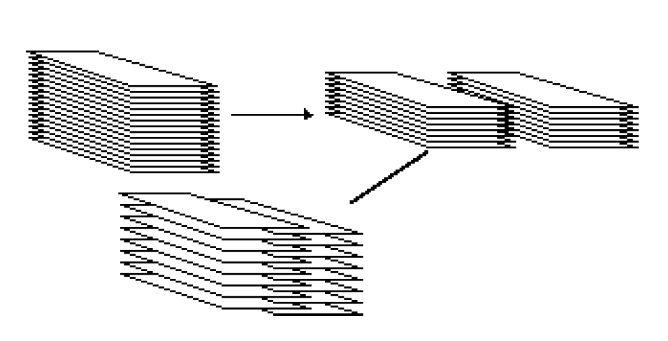

# Shuffle

In this assignment, you'll be writing two different methods to shuffle. (Shuffling will be very useful for any card games that we'd want to code, such as the Elevens game). To keeps things a bit simpler, we'll just be shuffling **arrays of integers** for this assignment. 

[1] The first method is **perfectShuffle()**. This method takes an int array as input (the unshuffled array) and returns another int array (the shuffled array). A "perfect shuffle" of a deck of cards is when a deck is split in half and the two half-decks are perfectly interwoven as shown below:



The perfectShuffle() method should shuffle an int array in the same way. For instance, consider the following int array before and after shuffling.

Before shuffling: [1, 2, 3, 4, 5, 21, 22, 23, 24, 25]

After shuffliing: [1, 21, 2, 22, 3, 23, 4, 24, 5, 25]

The method should have the following signature:
```shell script
public static int[] perfectShuffle(int[] arr) { }
```
<br />

[2] The second method is selectionShuffle(). This method takes an int array as input (the unshuffled array) and returns another int array (the shuffled array). Unlike perfect shuffle, selection shuffle works by incorporating randomness. The general code outline for selection shuffle is shown below:

* Loop through the array of integers
  * Swap each integer with another integer located at some random index of the array


The method should have the following signature:
```shell script
public static int[] selectionShuffle(int[] arr) { }
```

<br />

[3] Finally, write some code in the main method to test your methods. 

<br />
<br />

Add code to [MyMain.java](src/main/java/MyMain.java) to do the desired thing.

## Run your code with:
```shell script
make run
```

## Run your tests with:
```shell script
make test
```